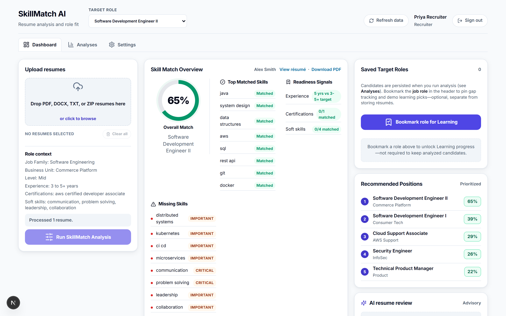
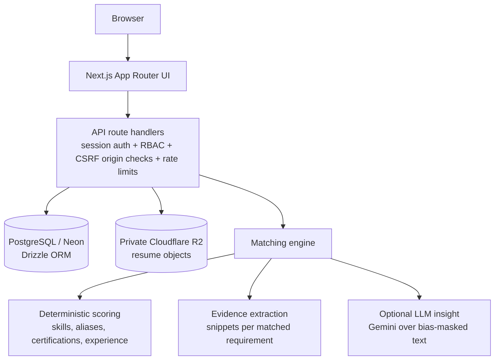

# SkillMatch AI

**Explainable candidate-to-role matching and skill-gap analysis.**

SkillMatch AI parses resumes, scores candidates against target roles with evidence-backed reasoning, surfaces skill gaps, and recommends learning paths — with role-based workflows for recruiters, hiring managers, L&D teams, employees, and administrators.



## Why this exists

Recruiters triage large volumes of resumes with tools that sit at two bad extremes: keyword filters that miss context, and opaque "AI scores" that nobody can defend in a hiring review. SkillMatch AI takes a third path:

- **Every score is explainable.** Each match breaks down into required skills, preferred skills, certifications, and experience — with the exact resume snippets that earned each point.
- **Humans stay in the loop.** The system is decision support, not an autonomous screener. Recruiters can override recommendations, and every override is audited.
- **Candidates get something too.** Skill gaps map to concrete learning recommendations, so the same engine powers employee career development, not just screening.

## Features

| Workflow | What it does |
| --- | --- |
| **Resume ingestion** | PDF, DOCX, TXT, and ZIP batch upload with file-signature validation, bounded ZIP expansion, and duplicate detection (SHA-256 content fingerprints) |
| **Role matching** | Weighted scoring against role requirements with per-component breakdowns and evidence snippets |
| **Skill-gap analysis** | Missing required/preferred skills per role, mapped to learning recommendations |
| **AI insight (optional)** | Gemini-generated structured summaries over bias-masked resume text, with a deterministic fallback when no API key is configured |
| **Role-based access** | Server-side RBAC for recruiter, hiring manager, L&D, employee, and admin areas |
| **Audit trail** | Hash-chained audit events for logins, uploads, overrides, and admin actions |
| **Career mode** | Employees save target roles and track readiness over time |

## Try it

Run it locally in demo mode — no database or external services needed:

```bash
npm ci
npm run dev
```

Open `http://localhost:3000` and sign in with a demo account (shown on the login page):

| Role | Email | Password |
| --- | --- | --- |
| Recruiter | `recruiter@skillmatch.demo` | `SkillMatchDemo!23` |
| System admin | `admin@skillmatch.demo` | `SkillMatchAdmin!23` |
| Learning & development | `learning@skillmatch.demo` | `SkillMatchLearn!23` |

In demo mode all data lives in process memory and resets on restart. Uploads are not persisted anywhere.

## Architecture



- **Single full-stack Next.js deployment** — UI, API, and matching run in one app (App Router, React 19, TypeScript).
- **Postgres via Drizzle ORM** with an in-memory fallback so the app runs, demos, and tests without infrastructure.
- **Private object storage** — resumes are stored in Cloudflare R2 under internal `r2://` keys and only served through an authorized API route. No public resume URLs.

## How matching works (honestly)

The core matcher is a **deterministic, explainable scoring engine** — not a black-box model:

1. Resume text is normalized and scanned against a skill taxonomy with aliases (e.g. "amazon web services" → AWS).
2. Certifications, years of experience, education, and location are extracted with targeted patterns.
3. Each role defines required/preferred skills, certifications, and experience ranges with weights; the candidate earns weight per matched requirement.
4. Every match records an evidence snippet from the resume, so the score decomposes into auditable parts.
5. Optionally, Gemini generates a structured narrative insight from bias-masked resume text. The LLM never produces the score — if the API is absent or fails, the deterministic result stands alone.

This is deliberate: for hiring-adjacent software, a slightly less clever score you can fully explain beats a cleverer one you can't.

## Security and privacy

- Public signup only ever creates the lowest-privilege `employee` role — a client-supplied role is stripped, never honored. Privileged roles are granted only through the admin user-management API (`PATCH /api/admin/users/:id`), and every role change is audited.
- Every sensitive API enforces server-side RBAC (the UI is never the security boundary).
- Same-origin (CSRF) checks on all cookie-authenticated mutations.
- Login and signup are rate-limited (durable via Upstash Redis when configured, per-instance fallback otherwise).
- Passwords hashed with scrypt; sessions are HMAC-signed, HttpOnly, SameSite cookies with an 8-hour lifetime.
- Resume files are private objects; downloads require recruiting-role authorization.
- Duplicate or failed uploads never leave orphaned resume objects (duplicate check runs before storage; failed persists trigger compensating deletion).
- ZIP uploads are expanded with hard limits on entry count, per-entry size, total size, and compression ratio; file signatures are validated before parsing.
- Audit events are hash-chained so tampering is detectable.

## Local development

```bash
npm ci
cp .env.example .env.local   # optional: enable database, storage, AI
npm run dev
```

Everything is optional locally — see [.env.example](.env.example) for what each variable enables:

| Variable | Purpose |
| --- | --- |
| `DATABASE_URL` | Neon/Postgres persistence (in-memory fallback when absent; required in production) |
| `AUTH_SECRET` | Session cookie signing secret (strong value required in production) |
| `AUTH_USERS_JSON` | Configured credential users (demo users when absent; required in production) |
| `R2_*` | Cloudflare R2 resume storage (in-memory fallback when absent; required in production) |
| `R2_PUBLIC_BASE_URL` | Legacy read-only compatibility for resume URLs stored by older versions — new uploads always use private `r2://` keys |
| `GEMINI_API_KEY` | Optional AI insight summaries (deterministic matching runs regardless) |
| `UPSTASH_REDIS_REST_URL/TOKEN` | Optional durable rate limiting across serverless instances |

To apply the database schema against a real `DATABASE_URL`:

```bash
npm run db:migrate
```

The migration entrypoint is idempotent and resolves `DATABASE_URL` from the shell, then `.env.local`, then `.env`.

## Testing

```bash
npm run lint     # ESLint
npm test         # Vitest: unit, route, RBAC/security, parser, persistence tests
npm run build    # Type-safe production build
npm run test:e2e # Playwright end-to-end (Chromium)
```

The unit suite covers the matching engine, upload parsing and adversarial file handling, RBAC on every sensitive route, privilege-escalation attempts, rate limiting, CSRF origin checks, and audit-chain integrity. Cross-browser E2E is opt-in:

```bash
PLAYWRIGHT_CROSS_BROWSER=1 npm run test:e2e
```

CI (GitHub Actions) runs lint, unit tests, build, and Chromium E2E on every PR, and uploads Playwright traces on failure.

## Deployment

The app deploys as a standard Next.js project on Vercel with Neon Postgres and Cloudflare R2. Production refuses to boot with demo credentials, weak secrets, or missing storage — environment validation fails fast instead of degrading silently.

See [docs/deployment.md](docs/deployment.md) for the full walkthrough, including custom-domain setup.

## Limitations and roadmap

Current, known limits — kept honest on purpose:

- The role catalog is seeded (six demo roles); a DB-backed role editor with pasted job-description import is the next planned feature.
- Matching is lexical (skills/aliases), so semantically equivalent phrasing without a known alias is missed; an embedding-based semantic layer behind the same evidence contract is planned.
- Experience extraction favors explicit "N years" phrasing over date-range inference.
- Candidate filtering happens in the application layer; SQL-level filtering and cursor pagination are planned before large datasets.

## Project history

SkillMatch AI began as a university software-engineering group project ([original repo](https://github.com/AliBenrami/SkillMatch-AI)) and has since been rehauled into this maintained portfolio project: security hardening (RBAC, CSRF, rate limiting, private storage), storage-consistency fixes, a new brand and UI, and expanded test coverage. The original repository preserves the full course history and team contributions.
